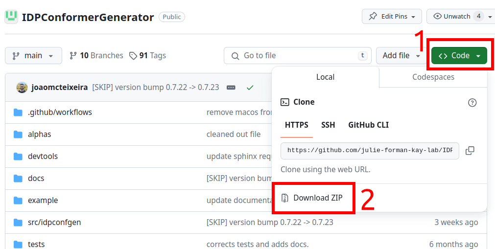

First steps
===========

IDPConformerGenerator (AKA IDPConfGen and IDPCG), is available for free on GitHub at:

    https://github.com/julie-forman-kay-lab/IDPConformerGenerator

In the repository above you can download the full source as explained in the
figure below or by this direct link and extract the ZIP file; this will create
the IDPConformerGenerator folder where all the source code resides. If you are
skilled with GitHub, you know you can directly clone the repository. 😉

|
To install the software, proceed with the :ref:`installation instructions <Installation>`
we provide in the official documentation page. If you have downloaded the ZIP,
you can skip the first instruction in the documentation page regarding the “git
clone”.

To run IDPConfGen, you also need to install third party software: DSSP, and
MCSCE. If you have access to CUDA compatible GPU, installing Int2Cart may provide improvements
on covalent bond geometry during the building process. Instructions to install these libraries are written
in the :ref:`respective section of the install instructions <installing-third-party-software>`:

Now that you have installed IDPConfGen, you can used it from the command line.
Remember to activate the ``idpconfgen`` python environment every time you open a
new terminal window. For example, with ``conda activate idpconfgen``.

You will now have access to the ``idpconfgen`` command which opens the door to all
the tools inside IDPConfGen. IDPCG is composed of several sub-clients
(sub-commands). Some tasks are completed with a single command (for example,
generating conformers), others require several commands (for example,
preparing the database).

In order to introduce our users to IDPConfGen we have prepared a series of
examples that users can navigate and reproduce to get used to the software. We
highly encourage your to run over those examples first. You can find the
examples inside the ``example/`` `directory <https://github.com/julie-forman-kay-lab/IDPConformerGenerator/tree/main/example>`_
and detailed tutorials can be found on the :ref:`usage documentation page <Usage>`.

Before you start, we want to briefly clarify the two main processes that
you will do with IDPConfGen:

*Step 1)* **Create your structural database.** You will need this database to
generate conformers. We provide all the commands and facilities required to
compile the initial database. This database is fully customizable, and can
serve several projects or be project specific. You can also reutilize it as much
as needed and share it with colleagues. In the examples, you will create small
databases for demonstration. Later, use the same commands as explained in the
examples to create a scientific relevant database. We suggest you to select one
of the `Dunbrack lab’s culled lists <http://dunbrack.fccc.edu/pisces/download/>`_
from the `PISCES server <http://dunbrack.fccc.edu/lab/pisces>`_.

We generally advise for a compromise between diversity and resolution, so we
suggest selecting the list with ``pc80`` and resolution 0.0-2.0A from the
download link above, for example the following file which contains 24857 chains:

    cullpdb_pc80.0_res0.0-2.0_len40-10000_R0.25_Xray_d2024_03_18_chains24857

*Step 2)* **Generate conformers.** We have two main commands to build
conformers: ``idpconfgen build`` to build IDP conformers and ``idpconfgen
ldrs`` to build IDR regions within folded domains.

Now that these two concepts were clarified, we invite you to go over the
examples.

Enjoy IDPConfGen, and keep in contact with us. For feedback or any doubts
please raise an issue on our repository if you are skilled with GitHub or
directly write us via E-mail to: Zi Hao Liu (nemo.liu@mail.utoronto.ca) or João
Teixeira (joaomcteixeira@gmail.com).

Refer to :ref:`our publications <How to cite>` for technical details on IDPCG and
please cite the project if you use it.
